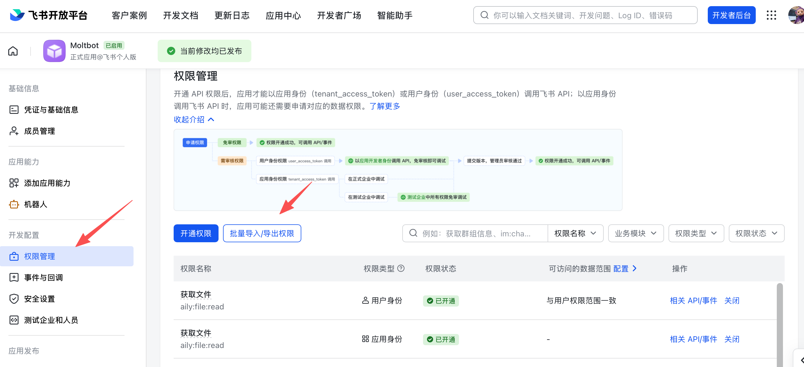
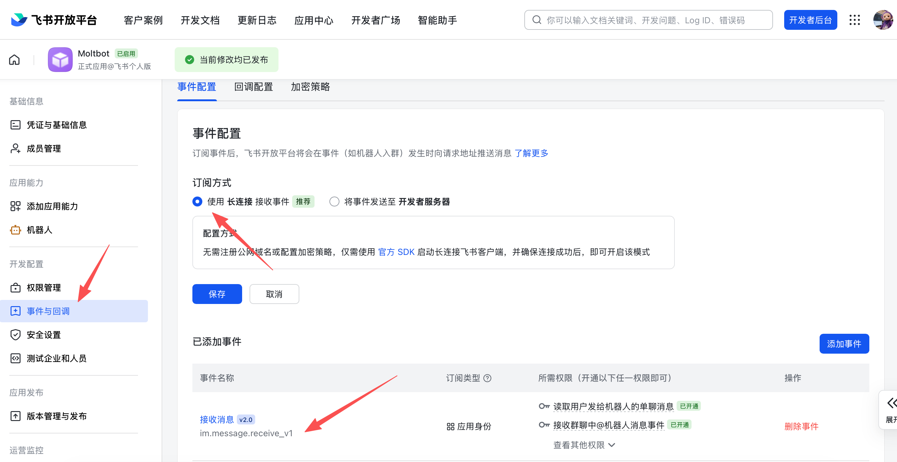

# Home Assistant Feishu Bot Integration

通过飞书官方 WebSocket 通道接收机器人消息，并将命令映射到 Home Assistant 服务调用。

## 功能

- WebSocket 接收飞书机器人消息（`im.message.receive_v1`）
- 默认将自然语言交给 Home Assistant `conversation` agent 处理并回复
- 支持在集成选项中指定 `agent_id`（选择具体 conversation agent）
- 兼容命令式控制 Home Assistant：
  - `ha:service <domain.service> {json}`
  - `ha:state <entity_id>`
  - `ha:scene <scene_id>`
- 执行结果回传飞书会话
- 提供诊断实体 `sensor.feishu_bot_status` 展示连接状态

## 安装

## 网络要求

- 本集成使用飞书 WebSocket 主动外连模式，**不需要公网 IP、端口映射或自有域名**。
- 只要 Home Assistant 所在环境可以主动访问飞书开放平台即可。
- 仅在你选择 HTTP 回调订阅方案时，才会需要可被飞书访问的公网地址。

### HACS（推荐）

[](https://my.home-assistant.io/redirect/hacs_repository/?owner=ha-china&repository=ha-feishu&category=integration)

一键安装链接：

```text
https://my.home-assistant.io/redirect/hacs_repository/?owner=ha-china&repository=ha-feishu&category=integration
```

1. HACS -> Integrations -> Custom repositories
2. 添加仓库 `https://github.com/ha-china/ha-feishu`，类别选择 Integration
3. 搜索并安装 `Feishu Bot`
4. 重启 Home Assistant

### 手动安装

将 `custom_components/feishu_bot` 复制到你的 HA 配置目录下。

## 配置

在 Home Assistant 界面中：

1. Settings -> Devices & Services -> Add Integration
2. 搜索 `Feishu Bot`
3. 填入：
   - `App ID`
   - `App Secret`

本集成不提供 HTTP 回调能力，也不需要配置回调 token/encrypt key。

可在集成选项中选择 Home Assistant 的对话代理（`agent_id`）。

## 飞书端操作步骤（WebSocket）

以下流程参考并适配自 OpenClaw 飞书文档：
`https://docs.openclaw.ai/channels/feishu`

### 1) 创建应用

1. 打开飞书开放平台：`https://open.feishu.cn/app`
2. 创建企业自建应用，填写应用名称与描述
3. 在“凭证与基础信息”记录：
   - `App ID`（通常是 `cli_xxx`）
   - `App Secret`


### 2) 配置权限

在“权限管理”中可以用“批量导入权限”，示例如下（来自参考文档，可按需精简）：

```json
{
  "scopes": {
    "tenant": [
      "aily:file:read",
      "aily:file:write",
      "application:application.app_message_stats.overview:readonly",
      "application:application:self_manage",
      "application:bot.menu:write",
      "cardkit:card:read",
      "cardkit:card:write",
      "contact:user.employee_id:readonly",
      "corehr:file:download",
      "event:ip_list",
      "im:chat.access_event.bot_p2p_chat:read",
      "im:chat.members:bot_access",
      "im:message",
      "im:message.group_at_msg:readonly",
      "im:message.p2p_msg:readonly",
      "im:message:readonly",
      "im:message:send_as_bot",
      "im:resource"
    ],
    "user": [
      "aily:file:read",
      "aily:file:write",
      "im:chat.access_event.bot_p2p_chat:read"
    ]
  }
}
```



### 3) 启用机器人能力

在“应用能力”中启用 Bot，并设置机器人名称。


### 4) 配置事件订阅（WebSocket）

在“事件订阅”中：

1. 选择“使用长连接接收事件（WebSocket）”
2. 添加事件：`im.message.receive_v1`



### 5) 发布应用

在“版本管理与发布”中创建版本并发布，确保企业内可用。

### 6) 回到 Home Assistant

在 HA 中使用同一个 `App ID` 和 `App Secret` 完成集成配置。
当 `sensor.feishu_bot_status` 显示 `connected` 即为连接成功。

## 命令示例

```text
打开客厅灯
现在家里温度是多少
把客厅灯调到暖光

# 可选：仍支持显式 HA 命令
ha:service light.turn_on {"entity_id":"light.living_room","brightness":180}
ha:state sensor.living_room_temperature
ha:scene scene.good_night
```

## 注意事项

- 建议在飞书应用权限里只开通必要权限。
- 如果自然语言无回复或意图异常，请在集成选项中切换 `Conversation agent`（优先测试 HA 内置 agent）。
- 该版本为首版，后续将补充更完整的 diagnostics 与 repair 流程。
